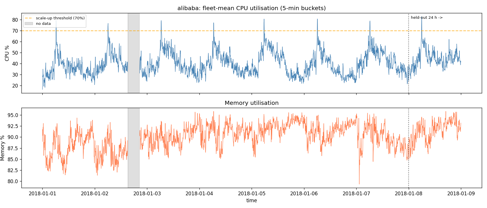
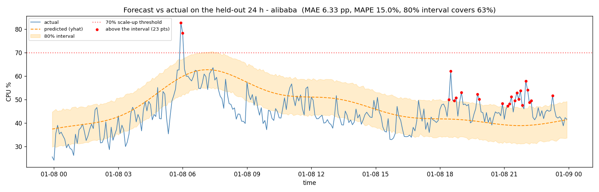
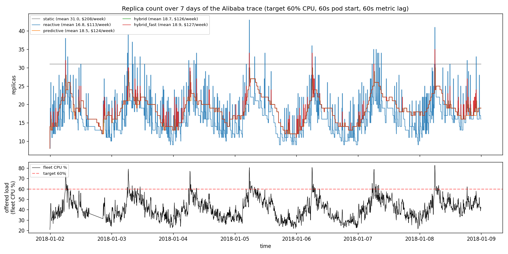

# AI Forecasting for Kubernetes Autoscaling — an Effectiveness and Cost Analysis

**Chi Zhang · CSE636 DevOps · Week 4 assignment**

Code, data and every transcript quoted below: <https://github.com/0luioiul0/cse636-week04>

## 1. Executive summary

On a real production workload, **AI forecasting did not save money over reactive
autoscaling — it cost 12% more.** Replaying eight days of the Alibaba
`cluster-trace-v2018` machine trace through a simulated Kubernetes HPA and
through a Prophet-driven predictive controller, the reactive baseline ran at
**$113/week** and the predictive controller at **$127/week**, against **$208/week**
for static over-provisioning. Both autoscalers held every SLO threshold I
measured. On this workload the entire cost story is *autoscaling versus not
autoscaling* — a 46% saving — and the forecast is a rounding error on top of it.

What the forecast did buy is **stability and reaction time**, and those are
measurable: the predictive controller started **541 pods over the week against
the HPA's 2 225** — a quarter of the churn, because it moves on the shape of the
day rather than on every noisy sample — and when pod startup time was raised to
10 minutes it spent **1 minute** above 90% CPU where the HPA spent **23**.

So the recommendation is conditional, and the condition is not "is the workload
predictable". It is **"is reacting expensive?"** If pods become ready in seconds,
reactive HPA is already the right answer and a forecasting pipeline is a
liability with a maintenance cost. If pods take minutes to become useful — JVM
services, model servers loading weights, anything with a warm cache — or if
scaling churn itself hurts (connection draining, rebalancing, per-start billing),
the forecast pays for itself.

One finding cuts across all of it. **A purely predictive controller is worse
than the HPA it replaces on anything it did not predict.** Under an
unforecastable flash crowd it dropped four times more load than plain reactive
HPA and stayed wrong for the full 20 minutes, because nothing in its loop looks
at reality. Adding a reactive floor — take the larger of what the forecast asks
for and what the current reading asks for — closed the gap completely, at
1% extra cost. Predictive autoscaling should be deployed as *a floor raiser on
top of* reactive autoscaling, never as a replacement for it.

## 2. Baseline: reactive HPA and where its lag comes from

The Kubernetes HorizontalPodAutoscaler is a control loop in
`kube-controller-manager`. Every sync period — 15 seconds by default — it reads
the current value of a metric across the Pods of a scale target and computes

> `desiredReplicas = ceil(currentReplicas × currentMetricValue / desiredMetricValue)`

with three dampers around it. A **tolerance** (0.1 by default) suppresses any
change while the ratio is within 10% of 1.0, so a fleet at 63% against a 60%
target does nothing. A **scale-down stabilisation window** (5 minutes) makes the
controller take the *highest* recommendation it has seen in that window, so one
quiet reading cannot shrink a deployment. **Scale-up policies** cap growth at
the larger of four pods or 100% of the current count per 15 seconds. Unready
Pods are excluded from the metric average and, when scaling up, are assumed to
consume 0% — which is what prevents a starting pod from being counted twice and
sending the loop into a doubling spiral. (I know that last one matters because
my first simulator got it wrong and produced 60-replica overshoots that real
Kubernetes does not.)

The limitation is that every term in that formula is about the past. The lag
between load arriving and capacity serving it is a sum of four delays:
**metric age** (metrics-server scrapes kubelets on a 15-second timer and the
kubelet's own accounting is not instantaneous, so the value read is typically
15–60 s old); **sync period** (up to another 15 s); **stabilisation and
tolerance** (by design — a controller that is fast to react oscillates); and
**pod readiness** — scheduling, image pull, process start, probe. Seconds for a
static binary, 30–90 s for a typical JVM service, minutes for anything that
loads a model or warms a cache.

Only the last term varies by orders of magnitude between workloads, and it is
the one that decides whether the lag matters. The harm is worst in exactly the
two cases the lecture names. On a **sharp spike** the whole lag budget is spent
while the service is already saturated: the HPA is not late by its sync period,
it is late by sync period *plus* startup. On a **slow-starting container** the
HPA makes the correct decision and it arrives after the event it was for.

A predictive approach attacks only the last term, and by moving the decision
earlier rather than making the loop faster. If at 06:00 you already know that
06:30 needs 26 replicas, the pods can start at 06:00 and be ready before the
load. Everything else about the controller stays the same — which is why the
sane deployment shape is a forecast *feeding* an HPA (through KEDA or a custom
metric), not a forecast *replacing* one.

## 3. The forecasting experiment

### 3.1 Data

**Source.** Alibaba `cluster-trace-v2018`, the `machine_usage` table — real
CPU and memory utilisation from a production cluster of 4 034 machines over 8
days. The lab handout's download URL returns **404**: the CSV is not in the
GitHub repository. The trace's own `fetchData.sh` points at an OSS bucket where
`machine_usage` is a **1.77 GB** tarball wrapping a **9.0 GB** CSV of roughly 246
million rows. Rows are grouped by machine, so my fetcher streams the tarball,
keeps the first 24 machine ids it encounters and closes the connection —
**2 MB of transfer** for eight days of 24 machines.

**Shape.** Each machine reports roughly once a minute; I resampled each onto a
5-minute grid and averaged the **22** serving machines (two of the 24 idle at
~5% CPU throughout and are a different workload class). Averaging is not
cosmetic: an HPA compares the *mean* utilisation across a Deployment's Pods to
its target. Result: **2 304 five-minute buckets over 8.00 days**, mean CPU
**40.4%**, range **16.5–82.7%**.

**What exploration showed.** A strong daily cycle — autocorrelation **+0.68** at
the 24-hour lag, busiest hour averaging 61% against 30% at the quietest — with a
**sharp morning ramp** rather than a smooth sine. Single 5-minute buckets reach
82.7% while the surrounding hour sits near 50%. And a real data-quality problem:
a **5.2-hour window on 2018-01-02 in which not one of the 22 machines reported**.
Memory sits at ~90% and barely moves, so on these machines it carries no scaling
signal at all — a useful reminder that "scale on CPU and memory" is advice, not
a law.

I kept the handout's synthetic generator as a **control**, and the comparison
turned out to be the most instructive result in the assignment.

### 3.2 Accuracy on the held-out 24 hours

Temporal split, never shuffled: 1 951 training points, the last **289** held
out. Prophet configured as the handout specifies (`daily_seasonality=True`,
`interval_width=0.80`). The one contested hyper-parameter — weekly seasonality,
which eight days cannot really identify — was chosen on a **validation day
carved out of the training data**, never on the test day.

| model / evaluation | MAE (pp) | MAPE | RMSE | bias | 80% interval covers |
|---|---|---|---|---|---|
| Prophet, weekly on (selected) | 6.33 | **15.0%** | 7.81 | +2.51 | 63.7% |
| Prophet, weekly off | 6.16 | 14.5% | 7.65 | +2.37 | 63.3% |
| *same code, handout's synthetic data* | *2.45* | *8.7%* | *3.13* | *+0.99* | *75.4%* |

**Where it was accurate.** The broad shape of the day: the overnight trough, the
timing of the morning ramp and the afternoon decay are all essentially right,
which is the part a capacity plan depends on.

**Where it failed, and why.** Two distinct failures, visible in the figure.

*The morning peak is rounded off.* Actual load hit **82.7%**; the model's point
forecast for that bucket was ~62% and its upper bound ~70%. Prophet represents
seasonality as a Fourier series, and a Fourier series with ten terms cannot
produce a corner — it necessarily smooths the sharpest feature in the data,
which is precisely the feature that decides whether you have enough capacity.

*The evening sits above the interval.* From roughly 18:00 onward the fleet ran
persistently higher than the seasonal curve predicted, producing a run of 24
points above the upper bound. This is not noise, it is a **level shift** the
model structurally cannot see: Prophet has no autoregressive term, so `yhat(t)`
is a function of the clock and not of what CPU is doing right now. The model
keeps predicting the average evening because it has no channel through which
"this evening is busier than average" can reach it.

The bias is **+2.5 points**, i.e. the model over-forecasts on average. That is
the safe direction — it buys capacity — but it is bought with money, and it
comes from Prophet extrapolating a **+13.7 point trend** fitted to eight days of
data past the end of that data.

### 3.3 The evaluation an autoscaler actually needs

The protocol above forecasts 24 hours ahead from a single fit. No autoscaler
does that: it re-decides every few minutes with all history up to *now*, and
looks one short horizon ahead. I re-ran the evaluation the way the controller
works — retrain at every 30-minute origin across the test day, forecast the next
30 minutes — and scored four cheap baselines on exactly the same points.

| method (30-min horizon, 1 728 scored points) | MAE (pp) — **real trace** | MAE (pp) — *synthetic* |
|---|---|---|
| ARIMA(2,1,2) on a trailing 24 h | **4.64** | 2.78 |
| Prophet + level adjustment | 4.90 | 2.46 |
| 30-minute moving average | 4.92 | 2.89 |
| persistence (last value) | 5.41 | 3.00 |
| **Prophet** | **5.70** | **2.34** |
| seasonal naive (value 24 h ago) | 7.31 | 6.74 |

**On the real trace, plain Prophet is beaten by a 30-minute moving average.**
It ranks fifth of six. On the handout's synthetic series the ranking inverts and
Prophet wins outright — because that series is a sum of two sines plus Gaussian
noise, which *is* Prophet's generative model. A study that evaluated only on
synthetic data would have concluded the opposite of the truth, and this is the
concrete reason to distrust any autoscaling benchmark that does not name its
workload.

The diagnosis is the missing autoregressive term, and the cheapest possible
repair confirms it: add the mean residual of the last 30 minutes back onto the
forecast (`prophet_level_adj`) and MAE falls from 5.70 to 4.90, with peak
coverage rising from 60% to 71%. Prophet contributes the *shape* of the day;
something else has to contribute the *level*.

**Would ARIMA have been the better choice?** On point accuracy at this horizon,
marginally yes — and it won *without any seasonal term*, which tells you that at
30 minutes most of the signal is short-range autocorrelation rather than daily
shape. Three things kept me on Prophet. A *seasonal* ARIMA would need m = 288 at
5-minute resolution, which `statsmodels` will not fit in usable time, so the
daily structure that makes 30-minutes-ahead scaling possible at all is
unavailable in the model that won. ARIMA needs a regularly spaced series and
would have to be handed interpolated values across the 5.2-hour outage and treat
them as real, whereas Prophet regresses on time and simply has no observation
there. And two of the 49 ARIMA fits failed to converge. The honest summary:
**Prophet for the daily shape, an AR/level term for the last half hour, and
neither one alone.**

### 3.4 A repeatability problem worth knowing about

Twelve identical runs of the same fit on the same data produce a bit-identical
`yhat` (spread 0.000) but a `yhat_upper` that moves by several tenths of a point
(roughly 0.5-1.0 pp across the batches I ran) — enough to flip the recommendation
between **17 and 18 replicas**. `yhat_upper` is
a Monte-Carlo estimate from 1 000 unseeded trajectories, and it is the number
the scaling rule actually consumes. An autoscaler wired straight to it would
start and stop a pod because of a random number. Raise `uncertainty_samples`,
seed the draw, or — the fix that survives production — act only on a change of
at least two replicas.

## 4. Cost-impact analysis

Rather than estimate an average replica count, I replayed the trace through the
controllers. Each scenario runs on a **10-second tick over 7 days** (60 481
ticks); the fleet-mean CPU of the 22 machines is read as an offered load
`L(t) = u(t) × 22` in "replica-percent", so R replicas each run at `L(t)/R`.
Pods are **paid for from the moment they are created** and carry load only after
the startup delay. The reactive controller implements the HPA algorithm of
section 2, metric lag included. The predictive controller refits Prophet
**hourly** — every fit seeing only its own past — and every 5 minutes sets
`ceil(max(yhat_upper over the next 30 min) × 22 / target)`.

**Assumptions**, all of them arguable: $0.04 per replica-hour (the handout's
figure, close to an on-demand `t3.medium` in `us-east-1`); target 60% CPU per
replica; min 2 / max 60 replicas; 60-second pod startup; 60-second metric lag;
"static over-provisioning" sized so the busiest 5-minute bucket of the week still
sits at the 60% target (= 31 replicas); an SLO breach counted as any period above
90% CPU per replica; and the trace's 5.2-hour gap linearly interpolated *for the
simulation only* — the forecaster still trains on the gapped series.

| scenario (7 days) | mean pods | replica-hours | **$/week** | vs static | pods started | min > 90% |
|---|---|---|---|---|---|---|
| static over-provisioning | 31.0 | 5 208 | **208.32** | — | 0 | 0 |
| reactive HPA | 16.8 | 2 827 | **113.07** | −45.7% | 2 225 | 0 |
| predictive (Prophet, 30 min, upper CI) | 18.5 | 3 103 | **124.11** | −40.4% | 129 | 0 |
| predictive + reactive floor | 18.7 | 3 141 | **125.63** | −39.7% | 237 | 0 |
| predictive + floor at HPA cadence | 18.9 | 3 174 | **126.96** | −39.1% | 541 | 0 |

**Reading the table honestly:** autoscaling of any kind saves ~45% against
standing capacity, and that is where essentially all the money is. Predictive
autoscaling then gives **12% of it back** ($113 → $127) and buys nothing
measurable in risk *at this pod startup time*. It is more expensive for a
structural reason, not a fixable one: it scales on `yhat_upper`, deliberately the
top of an interval, so it holds a margin the reactive controller does not.

The column that does move is churn. **2 225 pod starts against 541** — the HPA
reacts to noise, the forecast reacts to the day. On a platform that bills per
pod-second, or where a start costs a cache warm-up or a connection rebalance,
that column is the argument, not the dollars.

**Where the ranking flips.** Sweeping pod startup time with everything else
fixed:

| pod startup | reactive: min > 90% | predictive | predictive + floor |
|---|---|---|---|
| 15 s | 0 | 0 | 0 |
| 60 s | 0 | 0 | 0 |
| 150 s | 0 | 0 | 0 |
| 300 s | 4 | 0 | 0 |
| 600 s | **23** (4 min fully saturated) | 1 | 1 |

Cost is flat across this sweep; only risk moves. **Below about 5 minutes of
startup time the forecast is not buying anything**, and above it the reactive
controller degrades quickly while the predictive ones do not. That is the
condition, stated quantitatively, and it is a property of the *deployment*, not
of the workload's predictability.

**Real-world caveats.** One workload, one week, one price. Savings scale with
the peak-to-trough ratio: this trace runs 16–83%, roughly 5×, a moderately spiky
web-service shape — a flatter workload makes every autoscaler look worse, a
spikier one the reverse. The simulation assumes replicas are interchangeable and
load divides evenly, which no real service quite manages. And it charges nothing
for the forecasting pipeline itself — exporter, retraining, Prometheus series,
and the engineer who owns them. At $14/week of difference, about one hour of
that engineer's time per month erases the cost gap in either direction.

## 5. Limitations and failure modes

**The unforecastable event — and the counter-intuitive result.** I injected a
flash crowd (demand ×2 for 20 minutes) that nothing in the history predicts:

| controller | minutes with no capacity left | load dropped over the week |
|---|---|---|
| reactive HPA | 2 | 0.012% |
| **pure predictive** | **20** | **0.050%** |
| predictive + floor (5-min cadence) | 6 | 0.025% |
| predictive + floor (15-s cadence) | 2 | **0.007%** |

**A purely predictive controller is four times worse than the HPA it replaced**,
and it stays wrong for the entire event, because nothing in its loop looks at
reality. The mitigation is the reactive floor — take the larger of the
predictive and reactive requirements — and note that it only fully works when
the floor is evaluated at the *controller's* cadence, not the forecaster's. The
forecast may be hourly; the safety net has to be as fast as what it is catching.
This is the same shape both major clouds ship: AWS's predictive scaling for EC2
Auto Scaling and Google Cloud's predictive autoscaling for managed instance
groups both keep a reactive policy underneath and restrict the predictive
component to *adding* capacity.

**Model drift.** The trend term extrapolates whatever slope the last few days
had (+13.7 points here, from 8 days). A deployment, a campaign or a retired
feature changes the level and the model keeps predicting the old one until it is
refitted. Mitigations: refit on a schedule (hourly here), cap
`changepoint_prior_scale`, and — most importantly — **alert on the residual**.

**Silent staleness.** The failure that actually bites is not a crashed exporter
but a live one serving a number from a model nobody has refitted: a stale metric
looks exactly like a healthy one. Hence the `forecast_model_age_seconds` gauge
and the alert on it.

**Cold starts and the horizon.** A 30-minute horizon is only useful if pods
become ready in well under 30 minutes; as startup approaches the horizon the
forecast has to be lengthened, and error grows with horizon.

**Metric artefacts.** A saturated pod reports 100%, not 140% — the overload is
invisible to both controllers. Any autoscaler keyed to CPU alone under-reacts
exactly when it matters most; latency or queue depth is the better trigger, with
CPU as the cheap proxy. And per §3.4, the interval the whole scale-up rule rests
on wobbles by about a point between identical runs.

## 6. Recommendations

**Deploy predictive autoscaling when reacting is expensive**, which in practice
means: pod startup (including readiness and warm-up) above roughly **3–5
minutes**; or a workload where scaling churn itself costs — per-second billing,
connection draining, cache or shard rebalancing, GPU nodes that must be
provisioned before pods can schedule; or a strong, stable daily cycle whose peak
is sharp enough that a reactive controller is still filling the gap when the peak
arrives. My simulation puts the crossover for this workload at about 5 minutes
of startup time.

**Do not deploy it** for fast-starting stateless services. Reactive HPA is
cheaper, simpler, already installed and has no model to maintain, and this
experiment could not find a workload condition under which the forecast beat it
below 150 seconds of pod startup. "The workload is predictable" is not a
sufficient reason: this trace is highly predictable and reactive HPA still won on
cost.

**Deploy it as a floor, never as a replacement.** Publish the forecast and the
live metric as two triggers and let the autoscaler take the maximum (KEDA does
this natively). A dead forecaster then degrades to ordinary reactive
autoscaling rather than to none. Keep `minReplicas` and `maxReplicas` meaningful:
they are the only hard bound on a wrong model.

**Governance and monitoring** — the four things I would require before this goes
near production traffic:

- **Track forecast error as an SLI, not a dashboard curiosity.** Export
  predicted and observed side by side; alert when observed exceeds predicted by
  20% for 15 minutes (model drift or an unforecastable event — both need a
  human) and when model age exceeds an hour (silent staleness).
- **Quantise the output.** Act only on a change of ≥2 replicas, so Monte-Carlo
  noise in `yhat_upper` cannot start a pod.
- **Evaluate on the workload's own history, at the horizon you will actually
  use, against a moving-average baseline.** If the model cannot beat a 30-minute
  moving average — and here it could not — you have bought a maintenance
  burden, not a forecast.
- **Keep a documented rollback.** Removing the predictive trigger from the
  ScaledObject must be a one-line change that leaves a working reactive
  autoscaler behind, and it should be tested, not assumed.

## References

1. Kubernetes documentation, *Horizontal Pod Autoscaling* — the algorithm,
   tolerance, stabilisation windows and scaling policies.
   <https://kubernetes.io/docs/tasks/run-application/horizontal-pod-autoscale/>
2. Kubernetes documentation, *kube-controller-manager* — `--horizontal-pod-autoscaler-sync-period`
   (15 s), `--horizontal-pod-autoscaler-downscale-stabilization` (5 min).
3. Kubernetes SIG, *metrics-server* — default 15-second metric resolution.
   <https://github.com/kubernetes-sigs/metrics-server>
4. S. J. Taylor and B. Letham, "Forecasting at Scale", *The American
   Statistician* 72(1), 2018 — the Prophet decomposable model.
5. Alibaba Group, *cluster-trace-v2018*, `machine_usage`.
   <https://github.com/alibaba/clusterdata>
6. KEDA documentation, *Scaling Deployments* — multiple triggers, and the HPA's
   maximum-of-metrics behaviour. <https://keda.sh/docs/latest/concepts/scaling-deployments/>
7. AWS, *Predictive scaling for Amazon EC2 Auto Scaling*; Google Cloud,
   *Predictive autoscaling for managed instance groups* — both keep a reactive
   policy underneath and use the forecast only to add capacity.

## AI tool disclosure

I used **Claude (Opus 5)** in Claude Code throughout this assignment: to write
the fetching, simulation and evaluation scripts, to draft this report, and as a
reviewer of my own reasoning about the HPA algorithm.

**How the output was verified.** Nothing here is quoted from the model. Every
number in this report is produced by code in the repository and captured in a
transcript under `evidence/`, regenerated end-to-end by `python
scripts/run_all.py`; the figures are the ones that run writes. Where the model's
first answer was wrong, the code caught it: the simulator's initial HPA loop
averaged utilisation over *ready* pods and multiplied by the *total*, which
double-counts starting capacity and produced 60-replica overshoots — I found it
by looking at the replica trace, checked the documented algorithm, and fixed it
(§2). The claim that "Prophet beats simple baselines" was assumed at the start
and turned out to be false on this data, which is why §3.3 exists. The pure
scaling logic is unit-tested (17 tests, `scripts/tests/`), including the two
cases the reactive floor exists for. External facts — the dead dataset URL, the
tarball sizes, the HPA defaults — were checked against the primary sources listed
above rather than accepted from the model.
