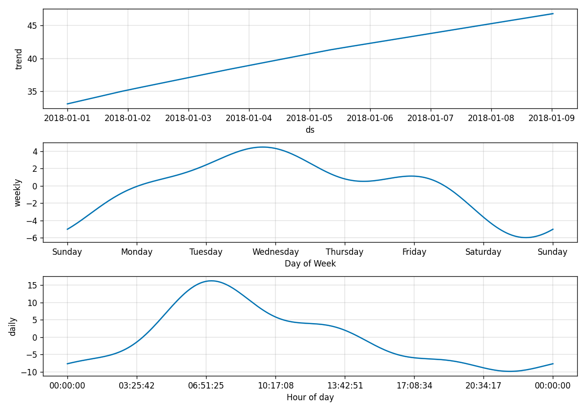

# Week 4 lab notes — forecasting CPU for autoscaling

**Chi Zhang · CSE636**

Notebook: [`notebooks/forecast.ipynb`](notebooks/forecast.ipynb) (outputs stored) ·
plots: [`figures/`](figures/) ·
transcripts: [`evidence/`](evidence/) ·
everything reproduces with `python scripts/run_all.py` (~2 min).

**Dataset.** Alibaba `cluster-trace-v2018`, `machine_usage` — real production
machines, 8 days, resampled to 5-minute buckets and averaged across the 22
serving machines, because an HPA reads the *average* CPU across a Deployment's
pods rather than any single one. The handout's download URL
(`.../raw/master/cluster-trace-v2018/machine_usage.csv`) returns **404**; the
file is not in the git repository. The real source is an OSS bucket named in the
trace's own `fetchData.sh`, where `machine_usage` is a 1.77 GB tarball wrapping a
9.0 GB CSV. Rows are grouped by machine, so
[`scripts/fetch_alibaba.py`](scripts/fetch_alibaba.py) streams the tarball, keeps
the first 24 machine ids and hangs up — **2 MB transferred instead of 1.77 GB**.
The handout's synthetic generator is kept alongside as a control, and the
comparison between the two turned out to be the most useful thing in the lab.

---

## 1. What MAPE did I achieve? Is it good enough for autoscaling?

| evaluation | MAE (pp CPU) | MAPE | 80% interval covers |
|---|---|---|---|
| **24 h ahead, one fit** (the handout's protocol) | 6.33 | **15.0%** | 63.7% |
| **30 min ahead, refit at each origin** (what an autoscaler does) | 5.70 | **12.7%** | 60% of peaks |
| same, level-adjusted (see below) | 4.90 | 11.1% | 73% of peaks |
| *the handout's synthetic data, 24 h ahead* | *2.45* | *8.7%* | *75.8%* |

**Good enough to size a fleet; not good enough to trust on its own.** Three
reasons, in increasing order of how much they worry me.

**MAPE is the least informative number here.** CPU utilisation is a percentage
already, so a 15% MAPE on a 40% mean is ~6 percentage points, and 6 points at a
60% target is one replica in ten. That is tolerable. But MAPE flatters a
forecaster on a series with a high floor: the same 6-point error at 20% CPU is a
30% MAPE and at 80% CPU is 7.5%, and it is the errors at the *top* of the range
that cost you an outage. MAE in percentage points is the number I would put on a
dashboard.

**The interval is not the safety margin it claims to be.** The scaling rule uses
`yhat_upper` — the top of the nominal **80%** interval — as a conservative
estimate. On the held-out day that interval contained only **63.7%** of the
actual points, and 8.3% of them landed *above* the upper bound. Rolling it
forward 30 minutes at a time, `max(yhat_upper)` covered the actual 30-minute peak
in **60% of 48 decisions**, with a mean shortfall of 7.0 points when it missed.
A margin that is wrong 40% of the time is a margin you have to plan around, not
one you can lean on.

**The synthetic control shows how easy it is to fool yourself.** On the
handout's generator the same code gets 8.7% MAPE and 75% interval coverage —
because that series *is* a sum of two sines plus Gaussian noise, which is
literally Prophet's model class. Reporting only that number would overstate the
method by nearly half. Whenever a vendor benchmark for a forecasting autoscaler
does not say what the data was, this is the first thing I would suspect.

---

## 2. What did the components plot reveal?



Three panels, three different levels of trust.

**Daily seasonality — real, and the whole reason forecasting is possible here.**
A **26.2 percentage-point** peak-to-trough swing, cresting at **07:00** and
bottoming at **21:00**. It is independently confirmed outside the model: the raw
autocorrelation at the 24-hour lag is **+0.68**. Note the shape — a *sharp*
morning ramp with a long decay, not a symmetric sine. Prophet fits it with a
Fourier series (10 terms by default for daily), and a Fourier series is bad at
corners: it rounds the top of the morning peak, which is exactly where the
scaling decision is hardest and where the model's biggest miss occurred.

**Trend — the panel I trust least.** Prophet bends the level up by **+13.7
points** across the window and keeps extrapolating that slope past the end of the
data. From eight days that is not an observation, it is a piecewise-linear fit to
a level that happened to be higher on day 8 than day 1. It also explains the
model's **+2.5 point positive bias** on the test day: over-forecasting is the
safe direction, but I am paying for it. In production I would cap this with
`changepoint_prior_scale` and a flat-trend growth mode, or simply not let a
horizon of 30 minutes inherit an 8-day trend at all.

**Weekly — present in the plot, not identifiable from the data.** Eight days is
**one** weekly cycle; the panel is drawn as confidently as the others and means
much less. I chose the seasonality setting on a validation day carved out of the
*training* data rather than on the test day, and it picked weekly-on
(validation MAE 5.95 vs 10.21). On the test day weekly-on was actually very
slightly *worse* (6.33 vs 6.16). The honest reading is not "the choice was
wrong": it is that a single validation day is too small to choose a
hyper-parameter from, and the difference here is smaller than the run-to-run
noise anyway.

**One more thing the plot cannot show you.** Prophet has **no autoregressive
term** — `yhat(t)` is a function of the clock, not of what CPU is doing right
now. That is why plain Prophet at a 30-minute horizon (MAE 5.70) loses to a
30-minute **moving average** (4.92), to **persistence** (5.41) and to an
**ARIMA(2,1,2)** (4.64). Adding the mean residual of the last 30 minutes back
onto the curve — six lines of code, `prophet_level_adj` — takes it to 4.90 and
lifts peak coverage from 60% to 73%. On the synthetic series the ranking flips
and Prophet wins outright. The lesson is not "Prophet is bad"; it is that the
seasonal shape and the current level are two different pieces of information and
Prophet only carries one of them.

---

## 3. If actual CPU hit 95% on a spike the model did not forecast

**What the recommendation does.** Nothing. The rule is
`ceil(replicas × predicted / target)` and `predicted` comes from the forecast, so
if the forecast says 45% the fleet stays sized for 45% while the pods burn at
95%. The forecast is a function of the clock; the clock does not know about the
spike. Worse, the failure is silent — the metric the autoscaler publishes still
looks healthy, because it is a prediction and predictions do not have outages.

**This is not hypothetical in this dataset.** The peak of the held-out day was
**82.7% CPU**, and 30 minutes earlier the model's upper bound for that window was
**60.4%** — a **22-point** shortfall on the single most important decision of
the day.

**What I did about it.** [`scripts/scaling.py`](scripts/scaling.py) takes the
**larger** of the predictive requirement and the requirement implied by the
current reading:

```python
predictive = ceil(replicas * predicted_cpu / target)
reactive   = ceil(replicas * observed_cpu  / target)
recommend  = max(predictive, reactive)      # a floor, never a ceiling
```

It costs nothing while the forecast leads — the reactive number is below the
predictive one whenever load is rising as expected, so the floor is silent — and
it is the only thing standing between an unforecast spike and a saturated
service. It never scales *down*, so it cannot fight the forecast. Tested in both
directions in [`scripts/tests/test_scaling.py`](scripts/tests/test_scaling.py).

**And then measured it,** by replaying the week through four controllers with an
unforecastable flash crowd injected (×2 demand for 20 minutes,
[`scripts/sweep.py`](scripts/sweep.py)):

| controller | minutes with no capacity left | load dropped |
|---|---|---|
| reactive HPA (the baseline) | 2 | 0.012% |
| **pure predictive** | **20** | **0.050%** |
| predictive + floor, floor checked every 5 min | 6 | 0.025% |
| predictive + floor, floor checked every 15 s | 2 | **0.007%** |

**Pure predictive autoscaling is four times worse than the plain HPA it
replaced** on the event it cannot see, and it stays wrong for the entire 20
minutes because nothing in the loop is looking at reality. The floor recovers
most of that, and recovers *all* of it once the floor runs at the HPA's cadence
rather than the forecaster's — the forecast can be hourly, but the safety net
has to be as fast as the thing it is catching.

**Three more things I would do in production:**

1. **Quantise the decision.** Twelve identical runs of the same fit produce a
   bit-identical `yhat` but a `yhat_upper` that ranges over several tenths of a
   point (roughly 0.5-1.0 across the batches I ran), which flips the recommendation
   between **17 and 18 replicas**
   ([`evidence/04-reproducibility.txt`](evidence/04-reproducibility.txt)).
   `yhat_upper` is a Monte-Carlo estimate from 1000 unseeded draws. Acting only
   on a change of ≥2 replicas costs nothing and stops the autoscaler churning a
   pod because of a random number.
2. **Alert on the residual, not the metric.** If observed CPU runs 20% above the
   forecast for 15 minutes, the model is drifting and the floor is quietly
   carrying the service. That alert is in
   [`k8s/keda-scaledobject.yaml`](k8s/keda-scaledobject.yaml) along with a
   staleness alert, because the failure mode that actually bites is an exporter
   that keeps serving a number from a model nobody has refitted.
3. **Keep the reactive trigger in the ScaledObject.** KEDA takes the maximum of
   its triggers, so publishing the forecast *and* the live metric as two
   triggers means a dead forecaster degrades to ordinary reactive autoscaling
   instead of to none at all.
